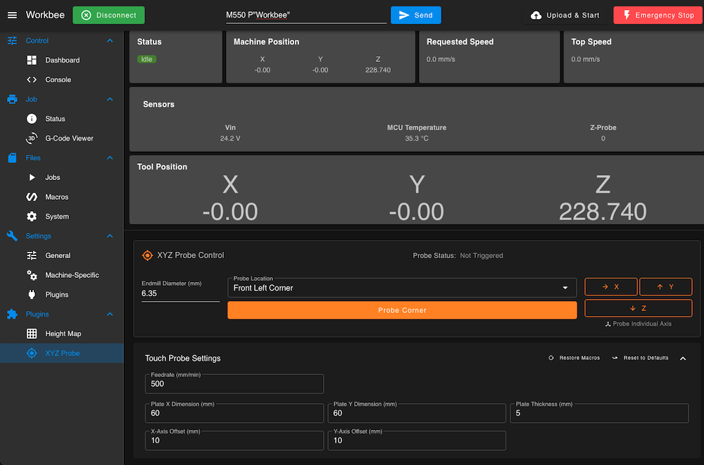

# Duet XYZ Probe Panel



A [Duet Web Control](https://github.com/Duet3D/DuetWebControl) plugin that adds an on-screen XYZ touch-probe panel — corner probing and individual X/Y/Z axis probing against a touch plate, with configurable plate dimensions, endmill diameter, offsets and feedrate.

> ⚠️ **Pre-release — use with caution.** This plugin has only had limited testing on real hardware. Before relying on it for a real job, verify your probe wiring/configuration and watch the first few probing moves closely so you can hit emergency stop if anything looks wrong.

## Why this exists

Ooznest's stock firmware/control panel for the WorkBee CNC includes a built-in XYZ touch-probe panel. If you move to vanilla RepRapFirmware + Duet Web Control (e.g. running a Duet 3 board instead of Ooznest's stock controller), that convenience disappears — there's no equivalent panel out of the box. This plugin brings that functionality back as a DWC plugin, usable on any vanilla RRF/DWC setup, not just Ooznest machines.

The probing routine itself was modeled on Ooznest's own WorkBee XYZ Touch Probe plate — the small rectangular block with a "Start Here" reference hole and a ledge that seats it flush against a stock corner. The plate's dimensions, thickness and offsets are all configurable settings here, though, so this isn't locked to that exact plate — any similarly-shaped touch plate can be used by entering its own measurements.

## How probing works — read this before your first probe

1. Jog the endmill to **approximately** the true X/Y corner of your stock (this is eyeballed — if you're using Ooznest's plate, its "Start Here" hole marks this point and helps you center by feel). Z height at this point doesn't matter much.
2. Press **Probe Corner** (or one of the individual axis buttons). From there, everything is automatic: the machine retracts, moves to the plate's center and probes Z, then moves out past each edge in turn, drops to the plate's side height, and probes inward to find X and Y.

> ⚠️ **This automated movement trusts your eyeballed starting position.** The moves to the plate's center and edges are calculated blindly from wherever you jogged to, using your Plate Dimension/Offset settings — there's no feedback until the probe actually triggers. If your starting position is badly off (not actually near the stock's true corner), the routine can miss the plate, fail to find an edge within its search range, or in the worst case drive the endmill into the plate, a clamp, or the table. Always watch the first probe of a session closely, with a hand near emergency stop.

## Requirements

- RepRapFirmware **3.3** or newer — this is a hard requirement, since the macros rely on `param.*` macro-parameter support, which RRF only gained in 3.3.
- Duet Web Control — **confirmed working on 3.6.x**. See the compatibility note below before installing on an older DWC.
- A touch probe configured in RepRapFirmware as probe index 0 (`M558 ... P0`)

### DWC version compatibility — please read if you're on DWC 3.5 or older

The plugin's manifest doesn't restrict installation to a specific DWC version range, so the installer will let you install it on any DWC 3.x. In practice, though, it's only been confirmed to actually *run* on **DWC 3.6.x**. On older DWC (tested and confirmed broken on stock DWC 3.4.6, and on Ooznest's DWC 3.3.0-based WorkBee fork), the plugin **installs successfully but fails to start**, with a `ChunkLoadError` in the browser console when you try to launch it.

This isn't a bug in the macros or a file-placement issue — it's been traced to a build-tooling mismatch: this plugin is compiled using the current DuetWebControl source tree's own build tooling, and older DWC releases' internal module-loading runtime doesn't seem to know how to load a plugin chunk built that way, regardless of where the files sit or what the manifest declares. It's left permissive intentionally so the community can help pin down exactly where the real cutoff is — DWC 3.5.x, in particular, is untested.

**If you hit this**: please [open an issue](../../issues) with your exact DWC and RRF version so we can narrow down the actual compatibility floor.

## Installation

1. Download the latest `ProbePanel-*.zip` from the [Releases page](../../releases).
2. In DWC, open **Settings** and use the plugin installer (the "Install Plugin" upload option) to select the downloaded zip.
3. Once installed, start the plugin — it appears in the left-hand navigation as **XYZ Probe**.

On first launch, the plugin automatically deploys its macro files to `0:/macros/ProbePanel/` on the SD card.

## Usage

**Main controls:**
- **Endmill Diameter** — diameter of the bit currently in the spindle. Used to compensate the probed position for the bit's radius.
- **Probe Location** — which corner of the touch plate you're probing against (Front Left / Front Right / Back Left / Back Right). If you're using a plate with a ledge like Ooznest's, rotate the physical plate so the ledge sits flush against whichever corner you select here.
- **Probe Corner** — runs the full automatic sequence described above and sets the work coordinate system (WCS) origin.
- **X / Y / Z buttons** — probe a single axis only, useful for re-zeroing one axis without repeating the full corner sequence. The Z button alone just probes straight down wherever the machine currently is, without any XY positioning.

**Touch Probe Settings** (collapsible section):
- **Feedrate** — probing speed (mm/min).
- **Plate X / Y Dimension** — full footprint of your touch plate, used to calculate the move to its center and past its edges.
- **Plate Thickness** — thickness of the plate, needed because Z-probing touches its top face rather than the true stock surface.
- **X / Y-Axis Offset** — distance from your starting position (the "Start Here" point) to the plate's near edge along each axis.

**Reset to Defaults** resets these settings fields back to their built-in defaults. It does **not** touch the macro files on the SD card.

**Restore Macros** re-deploys the default macro files, overwriting any edits you've made directly on the machine. Use it if you've customized a macro and want to get back to a known-good state.

## Dynamic macros — edit freely, no rewriting needed

The actual probing logic lives in plain RepRapFirmware G-code macro files on the SD card (`0:/macros/ProbePanel/probe-corner.g`, `probe-x.g`, `probe-y.g`, `probe-z.g`). You're free to open and edit these directly — add moves, change the probe order, tune retract distances, whatever you need.

What makes them "dynamic" is that the values from the panel (endmill diameter, plate dimensions, offsets, feedrate, and the direction signs derived from your selected corner) are **not hardcoded** into the macro files. Instead, every time you press a button, the plugin sends the macro call with your current panel settings as parameters, and the macro reads them via RRF's `param.*` syntax. That means changing a setting in the panel (say, switching from a 6mm to a 3mm endmill between jobs) takes effect immediately on your very next probe — no macro rewrite or redeploy required.

The one thing to be careful of: if you edit a macro and replace one of the `param.*` references with a fixed number, that panel field will silently stop having any effect on that macro. Each macro file has a comment block at the top listing which `param.*` variables it uses and what they mean.

## For developers

The macro files aren't hand-maintained on the SD card as the source of truth — they're generated from templates in **[`macros.js`](./macros.js)**. If you want to change the probing logic that ships with the plugin (as opposed to just editing your own already-deployed copy), edit the G-code template strings in that file.

The corner-direction logic (which way is "into the stock," and the axis swap needed when the plate is rotated for the FR/BL corners) is computed once in `ProbePanel.vue` and sent to the macros as ready-to-use values, so the macros themselves don't need to branch on which corner was selected:

| Parameter | Meaning |
|---|---|
| `param.A` | X direction sign (`+1` or `-1`) |
| `param.B` | Y direction sign (`+1` or `-1`) |
| `param.C` | X probe trigger direction (`M585` `S` value: `0` or `1`) |
| `param.D` | Y probe trigger direction (`M585` `S` value: `0` or `1`) |
| `param.E` | Endmill Diameter (mm) |
| `param.F` | Plate Thickness (mm) |
| `param.G` | X-Axis Offset (mm, corner-adjusted) |
| `param.H` | Y-Axis Offset (mm, corner-adjusted) |
| `param.I` | Plate X Dimension (mm, corner-adjusted) |
| `param.J` | Plate Y Dimension (mm, corner-adjusted) |
| `param.K` | Feedrate (mm/min) |

### Building a release zip

This is a Vue component (`ProbePanel.vue`) that has to be compiled into a loadable DWC plugin chunk — it can't just be zipped as source. Building requires a checkout of the main [DuetWebControl](https://github.com/Duet3D/DuetWebControl) repository, since that's what provides the build tooling:

1. Copy this repo's files (`plugin.json`, `ProbePanel.vue`, `index.js`, `macros.js`) into `src/plugins/ProbePanel/` inside a DuetWebControl checkout, overwriting what's there.
2. From inside that checkout, run:
   ```
   npm run build-plugin ProbePanel
   ```
3. This runs a full DWC build and produces `dist/ProbePanel-<version>.zip` — the file to attach to a GitHub release.

## License

[GNU General Public License v3.0](./LICENSE) — same license as DuetWebControl itself.
